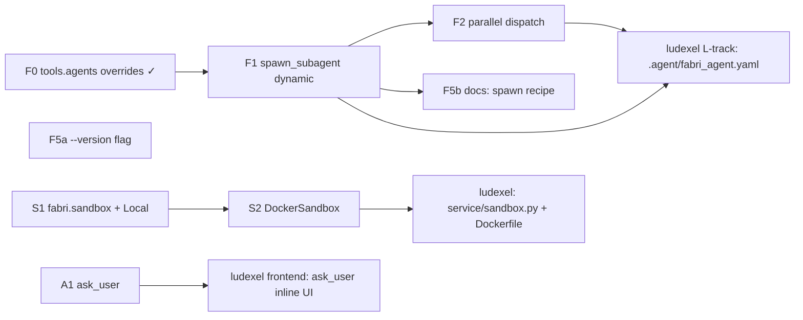

# Fabri Roadmap

> **North star:** reusable, sandbox-isolated agent framework. One YAML
> defines an agent; many concurrent instances run as fresh processes; tools
> ship as builtins so consuming projects only carry domain-specific tools.
>
> **This file IS the framework task tracker.** Companion to `TODO.md`
> (which holds correctness-audit fixes — P0/P1/P2). This file holds
> **forward feature work**. Reference card IDs (`F1`, `F2`, …) in commit
> messages and PR titles.
>
> **TODO.md status (as of v0.2.0):** P0 + P1 + P2 closed except (a)
> embedding `model_version` enforcement and (b) the `compress.py`
> tokenizer mismatch. P3 nits remain.
>
> **Card format:** `ID • Title • Track • Owner • Acceptance`

## Tracks

- **Track F — One-agent, multi-instance.** Make dynamic sub-agent spawning + parallel dispatch first-class so a single YAML can drive an arbitrary fanout at runtime.
- **Track S — Sandbox.** Promote the cwd-only `$FABRI_SANDBOX_ROOT` model into a real `Sandbox` interface with Local + Docker backends. Every tool routes through it.
- **Track A — Ask-user primitive.** Block on a clarifying question routed to a host process; enable interactive agents without coupling the framework to any UI.
- **Track R — Rename hygiene.** Sweep the `agent_memory` → `fabri` rename across env vars, trace dirs, and import shims.

Driven by the ludexel service rewrite (see ludexel `docs/ROADMAP.md`,
Track L), but every card is project-agnostic — the framework gets these
features for any future consumer.

---

## In Progress

- **F1** — dynamic `spawn_subagent` builtin (next; static precursor `F0` is
  shipped, so all the override plumbing F1 needs already exists).

## Backlog

### Track F — One-agent, multi-instance

- **F1** • `spawn_subagent` builtin (dynamic form) • Track F • — • New tool at `src/fabri/tools/examples/spawn_subagent.{py,json}`. Input schema `{config_path: str, system_prompt_path?: str, system_prompt_inline?: str, additional_context?: str, task: str, parallel_group?: str, timeout_s?: int}`. Shells out to `agent_runner_tool.py` with the chosen config and a per-call `system_prompt` override (extend the existing `--model`/`--max-tokens`/`--qdrant-url`/`--memory-collection` CLI surface added in v0.2.0 with `--system-prompt` / `--system-prompt-file`). Subprocess contract identical to `agent_runner_tool.py` (`{final_text, outcome, session_id, trace_path}`). Regression test: parent YAML enables `spawn_subagent`; one call returns `{final_text}` from a tiny sub-agent. **Builds on F0 (shipped):** the static `tools.agents[]` form, manifest pre-baked at startup, no per-call config selection — F1 is the dynamic counterpart.
- **F2** • Parallel-aware dispatch in runner loop • Track F • — • In `src/fabri/core/agent.py`, allow multiple `spawn_subagent` calls in the same parent step to launch concurrently when they share a `parallel_group`. Other tool calls stay serial; document this in the runner docstring. Child events stream back interleaved, tagged with child `run_id` and `parallel_group`. Test: parent issues 3 spawns with `parallel_group=g1`; trace shows overlapping child events. **Depends on F1.**
- **F5a** • `fabri --version` flag • Track F • — • Argparse currently rejects `fabri --version` (no such arg). Add `parser.add_argument("--version", action="version", version=f"fabri {importlib.metadata.version('fabri')}")` so host services can log the framework version per run. ~5-line change; ship independently of F1.
- **F5b** • Docs: builtin list + `spawn_subagent` recipe • Track F • — • README + `docs/creating-an-agent.md` cover the builtin tool list and a worked `spawn_subagent` recipe. **Depends on F1** (don't document a tool that doesn't exist). `fabri init` scaffold polish lives here too if anything surfaces while writing the recipe.

### Track S — Sandbox

- **S1** • `fabri.sandbox` package — `Sandbox` ABC + `LocalSandbox` • Track S • — • New `src/fabri/sandbox/__init__.py` with `Sandbox` ABC (`run_tool(manifest, payload, env) → result`, `sync_in(project_id, target_dir)`, `sync_out(project_id, dirty_paths)`, `dispose()`). `LocalSandbox` preserves today's behavior: subprocess in cwd restricted to `$FABRI_SANDBOX_ROOT`. Default when no `Sandbox` is configured. All existing builtins (`python_exec`, `bash`, `read_file`, `write_file`, `edit_file`, …) route through the active `Sandbox.run_tool` — backwards-compatible default keeps existing configs green.
- **S2** • `DockerSandbox` + `Dockerfile.base` • Track S • — • Warm pool of N containers. Pool checkout/return API. Bind-mount the working dir. Optional sync hooks injected by the host service (framework ships the interface; the host wires the storage backend, e.g. MinIO). `Dockerfile.base` in `src/fabri/sandbox/` does `pip install -e /opt/fabri` + bundled builtins; projects extend (`FROM fabri/sandbox:latest`). Same tool sequence runs identically under Local and Docker — that's the test. **Depends on S1.**

### Track A — Ask-user primitive

- **A1** • `ask_user` builtin • Track A • — • New tool at `src/fabri/tools/examples/ask_user.{py,json}`. Input `{question: str, options?: list[str], default?: str}` → output `{answer: str, selected_option?: str}`. Runner gains an `--ask-user-socket=<path>` flag; tool writes a JSON line `{kind: "ask_user", question_id, question, options?}` and blocks until a reply line `{question_id, answer}` arrives. Falls back to stdin when no socket configured (handy for CLI dev). Test: host spawns runner with a Unix socket; tool returns `{answer}` after host writes a reply.

### Track R — Rename hygiene

_(empty — R1 shipped before v0.1.0; see Done below.)_

---

## Done

- **F0** • Per-sub-agent overrides on `tools.agents[]` (static agent-as-tool) • Track F • v0.2.0 • `tools/agent_tool.py` + `tools/agent_runner_tool.py`. A parent `agent.yaml` can carry optional `model`, `max_tokens`, `qdrant_url`, `memory_collection` per `tools.agents[]` entry; these are threaded into the sub-agent runner as CLI flags (`--model`, `--max-tokens`, `--qdrant-url`, `--memory-collection`) and override the sub-agent's config at spawn time. A top-level `llm.decompose_model` lets the decompose tool run on a cheap model independent of the main backend. Sub-agent stdout now also returns `{session_id, trace_path}` so a parent trace points straight at the failing sub-agent's JSONL. **This is the static precursor F1 builds on:** the manifest is pre-baked at config-load time, not chosen per call.
- **R1** • `agent_memory` → `fabri` rename • Track R • shipped pre-v0.1.0 • `.fabri/` is the trace/log dir; `$FABRI_HOME` overrides the parent (`paths.py`). `BUILTIN_TOOLS_TOKENS = {"builtin", "builtin:tools"}` in `runtime.py:17` covers both `tools.manifest_dir` forms. The `$AGENT_MEMORY_HOME` shim and `agent_memory` import alias were dropped — the rename landed before any external consumer existed, so there was nothing to deprecate.

---

## Dependency graph

**Critical path for ludexel-service-MVP integration:** F0 → F1 → ludexel
.agent wiring; S1 → S2 → ludexel sandbox config; A1 → ludexel ask-user UI.
F2 is needed before ludexel can advertise "parallel multi-agent" but the
first end-to-end demo can ship without it (serial sub-agent spawns).

**ludexel today (as of v0.2.0):** the static F0 path is already in use —
`ludexel/.agent/game_content_agent.yaml` runs the orchestrator on Sonnet
4.6 and each domain sub-agent on Haiku via `tools.agents[].model`
overrides, plus `llm.decompose_model: claude-haiku-4-5` for cheap
decompose. F1 unlocks dynamic per-call sub-agent selection (one builtin
tool spawns any of N configs at runtime) on top of that.
