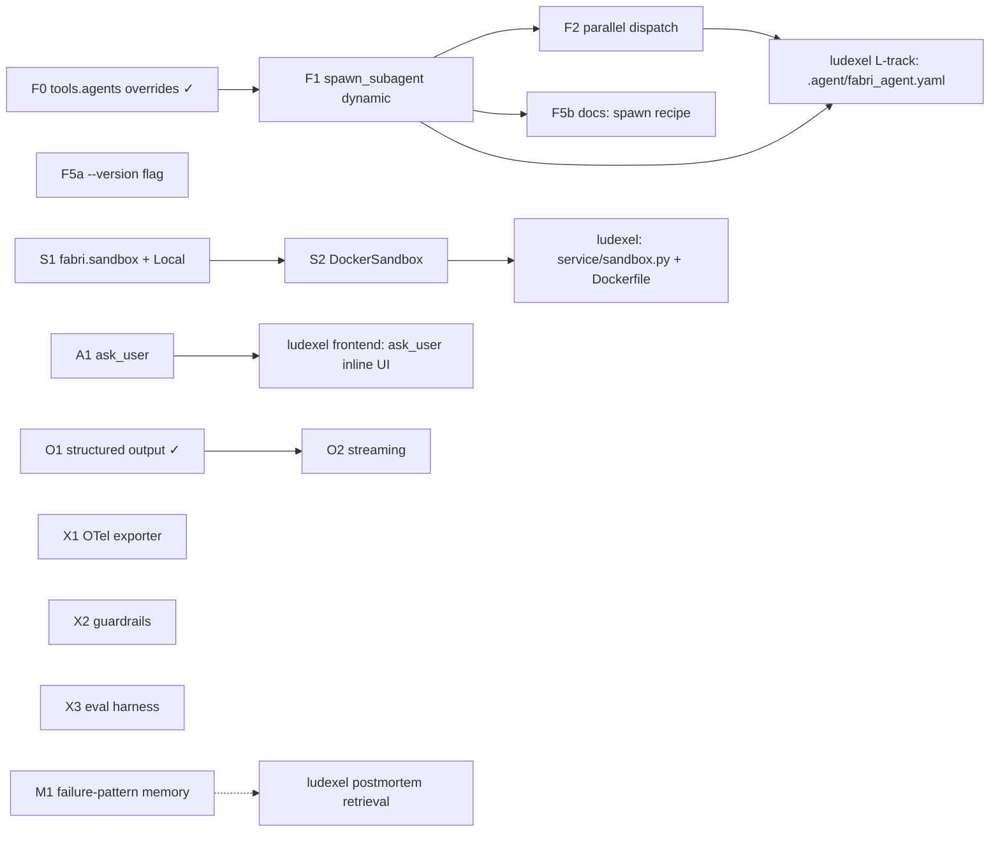

# Fabri Roadmap

> **North star:** reusable, sandbox-isolated agent framework. One YAML
> defines an agent; many concurrent instances run as fresh processes; tools
> ship as builtins so consuming projects only carry domain-specific tools.
>
> **This file IS the framework task tracker.** Companion to `TODO.md`
> (which holds correctness-audit fixes — P0/P1/P2). This file holds
> **forward feature work**. Reference card IDs (`F1`, `F2`, …) in commit
> messages and PR titles.
>
> **Status:** this file froze around v0.2.x; current release is v0.7.6.
> The F/S/A/R tracks below describe the original framework-rewrite
> roadmap. Everything from v0.3.0 onward (memory-store backends,
> host-integration ergonomics, the public-source release, etc.) is
> tracked in `CHANGELOG.md`, which is authoritative for what has
> shipped. Treat the "In Progress" / "Done" sections here as a
> historical snapshot — if a card isn't reflected in the changelog, it
> didn't ship under that ID. Open correctness/hardening items live in
> `TODO.md` (P2/P3 + test-coverage gaps). Open forward-feature cards:
> **F5b** (docs) plus the new **Track O / M / X** cards added from the
> v0.7.x competitive gap analysis (streaming, failure-pattern memory, OTel
> export, guardrails, eval harness). **O1 (structured output) has shipped —
> see Done.**
>
> **Card format:** `ID • Title • Track • Owner • Acceptance`

## Tracks

- **Track F — One-agent, multi-instance.** Make dynamic sub-agent spawning + parallel dispatch first-class so a single YAML can drive an arbitrary fanout at runtime.
- **Track S — Sandbox.** Promote the cwd-only `$FABRI_SANDBOX_ROOT` model into a real `Sandbox` interface with Local + Docker backends. Every tool routes through it.
- **Track A — Ask-user primitive.** Block on a clarifying question routed to a host process; enable interactive agents without coupling the framework to any UI.
- **Track R — Rename hygiene.** Sweep the `agent_memory` → `fabri` rename across env vars, trace dirs, and import shims.
- **Track O — Output & streaming.** First-class structured/typed output and token+event streaming so hosts get validated, responsive results instead of post-run JSONL only.
- **Track M — Memory (failure learning).** Extend the memory loop to mine *failed* and high-retry runs, not just successful summaries, so the agent retrieves "this loop bit you last week" hints.
- **Track X — Observability & safety.** External trace export (OpenTelemetry/Langfuse), composable guardrail processors, and a general correctness eval harness.

Tracks O/M/X were opened from the v0.7.x competitive gap analysis (see
`/Users/rushour0/.claude/plans/eager-mapping-sketch.md`): they close the
table-stakes capabilities most agent frameworks ship that fabri lacked.
Deliberate non-goals (voice/multimodal, hosted Studio UI, graph-workflow DSL,
broad first-party integrations, durable in-flight checkpoint/resume) stay
out-of-scope until a consumer needs them.

Driven by the ludexel service rewrite (see ludexel `docs/ROADMAP.md`,
Track L), but every card is project-agnostic — the framework gets these
features for any future consumer.

---

## In Progress

_(none tracked here — see `CHANGELOG.md` for current release work.)_

## Backlog

### Track F — One-agent, multi-instance

- **F5b** • Docs: builtin list + `spawn_subagent` recipe • Track F • — • README + `docs/creating-an-agent.md` cover the builtin tool list and a worked `spawn_subagent` recipe. `fabri init` scaffold polish lives here too if anything surfaces while writing the recipe.

### Track O — Output & streaming

- **O2** • Streaming (token + event) • Track O • — • `LLMBackend` gains a streaming variant; `run_agent` exposes an event/token stream (generator or callback) that emits the existing `events.py` vocabulary live instead of only writing JSONL post-run. Non-streaming path stays the default so frugality/caching behavior is unchanged. Acceptance: a caller can consume tokens + tool/step events as they happen; trace JSONL output is byte-identical to today for a non-streaming run. Loosely depends on O1. Touches `core/llm.py`, `core/agent.py`, `orchestrator/traces.py`. **Single most common capability fabri is missing (6/10 surveyed frameworks stream).**

### Track M — Memory (failure learning)

- **M1** • Postmortem-to-qdrant failure-pattern memory • Track M • _partially shipped_ • (= `TODO.md` P2, requested by ludexel 2026-06-24.) **Shipped (opt-in, `memory.record_postmortems`):** every run writes one deterministic, LLM-free postmortem `{task, outcome, step_count, tool_calls_total, repeated (tool × error-sig)}` as a new `postmortem` memory kind, retrieved by task similarity — the one-line "you tried X N times" hint. See `pipeline.build_postmortem_text`. **Remaining:** `final_diff`/`fix_pattern` extraction (the noisy-transcript hard part) + retrieval matching on predicted error kind, then flip the default on. Touches `orchestrator/pipeline.py`, `memory/store.py`. **Strengthens fabri's genuinely-unique differentiator (the self-improving memory loop).**

### Track X — Observability & safety

- **X1** • OpenTelemetry / Langfuse trace exporter • Track X • — • A thin, optional exporter mapping the existing `events.py` events to OTel spans (agent run = root span; steps / tool calls / model interactions = child spans carrying token + cost attributes). Off by default; enabled via config + env. Acceptance: with an OTLP endpoint configured, a run produces a hierarchical trace in any OTel-compatible backend (Datadog/Honeycomb/Langfuse); with it unset, behavior is unchanged. Touches `events.py`, new `observability/otel.py`. **fabri's JSONL traces are rich but internal-only; a thin layer over them unlocks enterprise observability cheaply.**
- **X2** • Guardrail processors (input/output) • Track X • — • A composable processor pipeline running before the LLM (prompt-injection / PII / moderation) and after (output filtering / token cap). Ships a couple of reference processors plus a stable processor interface so hosts add their own. Acceptance: a configured PII-redaction processor masks input before the model sees it; an injection processor can block or rewrite; processors compose in declared order. Touches `config.py`, new `guardrails/` package, `core/agent.py`. **Mastra ships a processor pipeline, OpenAI SDK ships guardrails; fabri has none. Fits "frugal + safe by default".**
- **X3** • Correctness eval harness • Track X • — • Generalize the existing `benchmarks/` scaffolding into a reusable scorer framework: LLM-as-judge, rule-based/assertion, and exact-match scorers over a task→expected dataset, with per-case isolation and aggregate reporting (reuse the `longmemeval` runner's structure). Acceptance: a small dataset runs through all three scorer types and emits a pass-rate report under `.fabri/benchmarks/`. Touches `benchmarks/`. **Today fabri proves cost (`session_delta`) and memory (`longmemeval`) but not general task correctness.**

**Suggested build order (not enforced):** O1 → O2, then M1 (consumer-requested),
then X1 (cheap, high enterprise leverage), then X2 + X3 (quality/safety story).

### Track R — Rename hygiene

_(empty — R1 shipped before v0.1.0; see Done below.)_

---

## Done

- **O1** • Structured / typed output • Track O • Unreleased • `src/fabri/core/structured.py` (dependency-free JSON-Schema-subset validator) + `core/agent.py`. `agent.response_schema` validates the single-loop final answer; a mismatch re-prompts with the errors up to `agent.response_retries` times, then `agent.error_strategy` resolves (`strict` → new `Outcome.INVALID_OUTPUT`; `warn` → unvalidated text as success; `fallback` → `agent.response_fallback`). The validated value rides back on the run result as `structured_output` (also surfaced by the sub-agent runner). Per-attempt `structured_output` trace event. Validation lives at the loop layer so `core/llm.py` is untouched and every provider gets it free; planner path skips with a logged warning. 18 tests (validator unit + run_agent e2e).
- **F0** • Per-sub-agent overrides on `tools.agents[]` (static agent-as-tool) • Track F • v0.2.0 • `tools/agent_tool.py` + `tools/agent_runner_tool.py`. A parent `agent.yaml` can carry optional `model`, `max_tokens`, `qdrant_url`, `memory_collection` per `tools.agents[]` entry; these are threaded into the sub-agent runner as CLI flags (`--model`, `--max-tokens`, `--qdrant-url`, `--memory-collection`) and override the sub-agent's config at spawn time. A top-level `llm.decompose_model` lets the decompose tool run on a cheap model independent of the main backend. Sub-agent stdout now also returns `{session_id, trace_path}` so a parent trace points straight at the failing sub-agent's JSONL. **This is the static precursor F1 builds on:** the manifest is pre-baked at config-load time, not chosen per call.
- **R1** • `agent_memory` → `fabri` rename • Track R • shipped pre-v0.1.0 • `.fabri/` is the trace/log dir; `$FABRI_HOME` overrides the parent (`paths.py`). `BUILTIN_TOOLS_TOKENS = {"builtin", "builtin:tools"}` in `runtime.py:17` covers both `tools.manifest_dir` forms. The `$AGENT_MEMORY_HOME` shim and `agent_memory` import alias were dropped — the rename landed before any external consumer existed, so there was nothing to deprecate.
- **F5a** • `fabri --version` flag • Track F • v0.2.1 • Argparse `action="version"` reads installed wheel metadata via `importlib.metadata.version("fabri")` so host services can log the framework version per run. No constant to drift out of sync with `pyproject.toml`.
- **F1** • `spawn_subagent` builtin (dynamic form) • Track F • v0.2.1 • `src/fabri/tools/examples/spawn_subagent.{py,json}`. Parent agents pick the sub-agent config at runtime; shells out to the same `agent_runner_tool.py` the static F0 path uses. Runner gained `--system-prompt` / `--system-prompt-file` (mutually exclusive). `build_runner_command` is exposed so flag plumbing is unit-tested in isolation; integration tests stub the runner via a per-test fake script.
- **A1** • `ask_user` builtin + runner socket flag • Track A • v0.2.1 • `src/fabri/tools/examples/ask_user.{py,json}` + `--ask-user-socket=<path>` on the runner (and `fabri run`). Socket transport: one JSON line per question + reply, `question_id` keeps concurrent sub-agents' replies from crossing wires. Stdin fallback for CLI dev. Tool inherits `FABRI_ASK_USER_SOCKET` from `os.environ` so no registry plumbing was needed.
- **S1** • `fabri.sandbox` package — `Sandbox` ABC + `LocalSandbox` • Track S • v0.2.1 • `src/fabri/sandbox/__init__.py`. ABC has `run_tool` / `sync_in` / `sync_out` / `dispose`. `LocalSandbox` lifts today's `$FABRI_SANDBOX_ROOT` behavior into an object; `ToolRegistry` defaults to it when no sandbox is passed, so the pre-S1 behavior holds end-to-end. All 169 prior tests still pass without modification.
- **F2** • Parallel-aware dispatch in runner loop • Track F • v0.2.1 • `src/fabri/core/agent.py` indexes `spawn_subagent` calls by `parallel_group` and fans them out via `ThreadPoolExecutor`. Non-spawn calls and ungrouped spawn calls stay serial. Assistant/user message blocks preserve original call order. `tool_call` trace events for parallel calls carry the `parallel_group` field so a trace-tail viewer can group fan-out activity visually.
- **S2** • `DockerSandbox` + `Dockerfile.base` • Track S • v0.2.1 • `src/fabri/sandbox/docker_sandbox.py`. Pooled warm-container backend; lazy fill on first acquire. State ferrying intentionally deferred to host-injected `sync_in_hook` / `sync_out_hook` callbacks. Shells out to the `docker` CLI rather than depending on docker-py. `Dockerfile.base` ships in `src/fabri/sandbox/`; included in `package-data` so an installed wheel can build `fabri/sandbox:latest` directly. Unit tests use a `FakeBackend`; one real-Docker integration test runs only when `docker info` succeeds.

---

## Dependency graph

**Critical path for ludexel-service-MVP integration:** F0 → F1 → ludexel
.agent wiring; S1 → S2 → ludexel sandbox config; A1 → ludexel ask-user UI.
F2 is needed before ludexel can advertise "parallel multi-agent" but the
first end-to-end demo can ship without it (serial sub-agent spawns).

**ludexel today (snapshot as of v0.2.0 — not reverified against current ludexel):** the static F0 path was in use —
`ludexel/.agent/game_content_agent.yaml` runs the orchestrator on Sonnet
4.6 and each domain sub-agent on Haiku via `tools.agents[].model`
overrides, plus `llm.decompose_model: claude-haiku-4-5` for cheap
decompose. F1 unlocks dynamic per-call sub-agent selection (one builtin
tool spawns any of N configs at runtime) on top of that.
