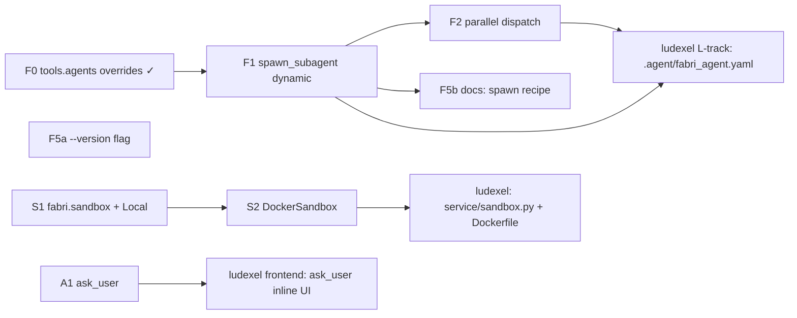

# Fabri Roadmap

> **North star:** reusable, sandbox-isolated agent framework. One YAML
> defines an agent; many concurrent instances run as fresh processes; tools
> ship as builtins so consuming projects only carry domain-specific tools.
>
> **This file IS the framework task tracker.** Companion to `TODO.md`
> (which holds correctness-audit fixes — P0/P1/P2). This file holds
> **forward feature work**. Reference card IDs (`F1`, `F2`, …) in commit
> messages and PR titles.
>
> **TODO.md status (as of v0.2.0):** P0 + P1 + P2 closed except (a)
> embedding `model_version` enforcement and (b) the `compress.py`
> tokenizer mismatch. P3 nits remain.
>
> **Card format:** `ID • Title • Track • Owner • Acceptance`

## Tracks

- **Track F — One-agent, multi-instance.** Make dynamic sub-agent spawning + parallel dispatch first-class so a single YAML can drive an arbitrary fanout at runtime.
- **Track S — Sandbox.** Promote the cwd-only `$FABRI_SANDBOX_ROOT` model into a real `Sandbox` interface with Local + Docker backends. Every tool routes through it.
- **Track A — Ask-user primitive.** Block on a clarifying question routed to a host process; enable interactive agents without coupling the framework to any UI.
- **Track R — Rename hygiene.** Sweep the `agent_memory` → `fabri` rename across env vars, trace dirs, and import shims.

Driven by the ludexel service rewrite (see ludexel `docs/ROADMAP.md`,
Track L), but every card is project-agnostic — the framework gets these
features for any future consumer.

---

## In Progress

_(none — F1/F2/F5a/S1/S2/A1 all shipped in v0.2.1.)_

## Backlog

### Track F — One-agent, multi-instance

- **F5b** • Docs: builtin list + `spawn_subagent` recipe • Track F • — • README + `docs/creating-an-agent.md` cover the builtin tool list and a worked `spawn_subagent` recipe. `fabri init` scaffold polish lives here too if anything surfaces while writing the recipe.

### Track R — Rename hygiene

_(empty — R1 shipped before v0.1.0; see Done below.)_

---

## Done

- **F0** • Per-sub-agent overrides on `tools.agents[]` (static agent-as-tool) • Track F • v0.2.0 • `tools/agent_tool.py` + `tools/agent_runner_tool.py`. A parent `agent.yaml` can carry optional `model`, `max_tokens`, `qdrant_url`, `memory_collection` per `tools.agents[]` entry; these are threaded into the sub-agent runner as CLI flags (`--model`, `--max-tokens`, `--qdrant-url`, `--memory-collection`) and override the sub-agent's config at spawn time. A top-level `llm.decompose_model` lets the decompose tool run on a cheap model independent of the main backend. Sub-agent stdout now also returns `{session_id, trace_path}` so a parent trace points straight at the failing sub-agent's JSONL. **This is the static precursor F1 builds on:** the manifest is pre-baked at config-load time, not chosen per call.
- **R1** • `agent_memory` → `fabri` rename • Track R • shipped pre-v0.1.0 • `.fabri/` is the trace/log dir; `$FABRI_HOME` overrides the parent (`paths.py`). `BUILTIN_TOOLS_TOKENS = {"builtin", "builtin:tools"}` in `runtime.py:17` covers both `tools.manifest_dir` forms. The `$AGENT_MEMORY_HOME` shim and `agent_memory` import alias were dropped — the rename landed before any external consumer existed, so there was nothing to deprecate.
- **F5a** • `fabri --version` flag • Track F • v0.2.1 • Argparse `action="version"` reads installed wheel metadata via `importlib.metadata.version("fabri")` so host services can log the framework version per run. No constant to drift out of sync with `pyproject.toml`.
- **F1** • `spawn_subagent` builtin (dynamic form) • Track F • v0.2.1 • `src/fabri/tools/examples/spawn_subagent.{py,json}`. Parent agents pick the sub-agent config at runtime; shells out to the same `agent_runner_tool.py` the static F0 path uses. Runner gained `--system-prompt` / `--system-prompt-file` (mutually exclusive). `build_runner_command` is exposed so flag plumbing is unit-tested in isolation; integration tests stub the runner via a per-test fake script.
- **A1** • `ask_user` builtin + runner socket flag • Track A • v0.2.1 • `src/fabri/tools/examples/ask_user.{py,json}` + `--ask-user-socket=<path>` on the runner (and `fabri run`). Socket transport: one JSON line per question + reply, `question_id` keeps concurrent sub-agents' replies from crossing wires. Stdin fallback for CLI dev. Tool inherits `FABRI_ASK_USER_SOCKET` from `os.environ` so no registry plumbing was needed.
- **S1** • `fabri.sandbox` package — `Sandbox` ABC + `LocalSandbox` • Track S • v0.2.1 • `src/fabri/sandbox/__init__.py`. ABC has `run_tool` / `sync_in` / `sync_out` / `dispose`. `LocalSandbox` lifts today's `$FABRI_SANDBOX_ROOT` behavior into an object; `ToolRegistry` defaults to it when no sandbox is passed, so the pre-S1 behavior holds end-to-end. All 169 prior tests still pass without modification.
- **F2** • Parallel-aware dispatch in runner loop • Track F • v0.2.1 • `src/fabri/core/agent.py` indexes `spawn_subagent` calls by `parallel_group` and fans them out via `ThreadPoolExecutor`. Non-spawn calls and ungrouped spawn calls stay serial. Assistant/user message blocks preserve original call order. `tool_call` trace events for parallel calls carry the `parallel_group` field so a trace-tail viewer can group fan-out activity visually.
- **S2** • `DockerSandbox` + `Dockerfile.base` • Track S • v0.2.1 • `src/fabri/sandbox/docker_sandbox.py`. Pooled warm-container backend; lazy fill on first acquire. State ferrying intentionally deferred to host-injected `sync_in_hook` / `sync_out_hook` callbacks. Shells out to the `docker` CLI rather than depending on docker-py. `Dockerfile.base` ships in `src/fabri/sandbox/`; included in `package-data` so an installed wheel can build `fabri/sandbox:latest` directly. Unit tests use a `FakeBackend`; one real-Docker integration test runs only when `docker info` succeeds.

---

## Dependency graph

**Critical path for ludexel-service-MVP integration:** F0 → F1 → ludexel
.agent wiring; S1 → S2 → ludexel sandbox config; A1 → ludexel ask-user UI.
F2 is needed before ludexel can advertise "parallel multi-agent" but the
first end-to-end demo can ship without it (serial sub-agent spawns).

**ludexel today (as of v0.2.0):** the static F0 path is already in use —
`ludexel/.agent/game_content_agent.yaml` runs the orchestrator on Sonnet
4.6 and each domain sub-agent on Haiku via `tools.agents[].model`
overrides, plus `llm.decompose_model: claude-haiku-4-5` for cheap
decompose. F1 unlocks dynamic per-call sub-agent selection (one builtin
tool spawns any of N configs at runtime) on top of that.
