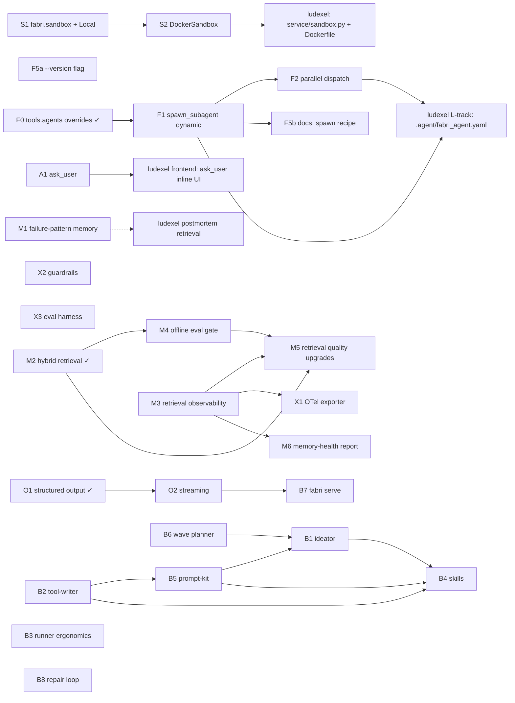

# Fabri Roadmap

> **North star:** reusable, sandbox-isolated agent framework. One YAML
> defines an agent; many concurrent instances run as fresh processes; tools
> ship as builtins so consuming projects only carry domain-specific tools.
>
> **This file IS the framework task tracker.** Companion to `TODO.md`
> (which holds correctness-audit fixes — P0/P1/P2). This file holds
> **forward feature work**. Reference card IDs (`F1`, `F2`, …) in commit
> messages and PR titles.
>
> **Status:** this file froze around v0.2.x; current release is v0.7.6.
> The F/S/A/R tracks below describe the original framework-rewrite
> roadmap. Everything from v0.3.0 onward (memory-store backends,
> host-integration ergonomics, the public-source release, etc.) is
> tracked in `CHANGELOG.md`, which is authoritative for what has
> shipped. Treat the "In Progress" / "Done" sections here as a
> historical snapshot — if a card isn't reflected in the changelog, it
> didn't ship under that ID. Open correctness/hardening items live in
> `TODO.md` (P2/P3 + test-coverage gaps). Open forward-feature cards:
> **F5b** (docs) plus the new **Track O / M / X** cards added from the
> v0.7.x competitive gap analysis (streaming, failure-pattern memory, OTel
> export, guardrails, eval harness). **O1 (structured output) has shipped —
> see Done.**
>
> **Card format:** `ID • Title • Track • Owner • Acceptance`

## Tracks

- **Track F — One-agent, multi-instance.** Make dynamic sub-agent spawning + parallel dispatch first-class so a single YAML can drive an arbitrary fanout at runtime.
- **Track S — Sandbox.** Promote the cwd-only `$FABRI_SANDBOX_ROOT` model into a real `Sandbox` interface with Local + Docker backends. Every tool routes through it.
- **Track A — Ask-user primitive.** Block on a clarifying question routed to a host process; enable interactive agents without coupling the framework to any UI.
- **Track R — Rename hygiene.** Sweep the `agent_memory` → `fabri` rename across env vars, trace dirs, and import shims.
- **Track O — Output & streaming.** First-class structured/typed output and token+event streaming so hosts get validated, responsive results instead of post-run JSONL only.
- **Track M — Memory (failure learning + retrieval quality).** Extend the memory loop to mine *failed* and high-retry runs, not just successful summaries, so the agent retrieves "this loop bit you last week" hints. Also covers retrieval quality: hybrid search, temporal decay, MMR diversification, domain routing (M2 shipped v0.9.0).
- **Track X — Observability & safety.** External trace export (OpenTelemetry/Langfuse), composable guardrail processors, and a general correctness eval harness.
- **Track B — Builder (idea → running self-improving agent).** Turn the engine into a product factory: scaffold agents, tools, and prompts from intent, package reusable bundles as skills, and embed the whole thing as a self-contained service so building a new product on fabri is faster, not slower. See [vision.md](vision.md) for the layered engine+builder thesis.

Tracks O/M/X were opened from the v0.7.x competitive gap analysis (see
`/Users/rushour0/.claude/plans/eager-mapping-sketch.md`): they close the
table-stakes capabilities most agent frameworks ship that fabri lacked.
Deliberate non-goals (voice/multimodal, hosted Studio UI, graph-workflow DSL,
broad first-party integrations, durable in-flight checkpoint/resume) stay
out-of-scope until a consumer needs them.

Driven by the ludexel service rewrite (see ludexel `docs/ROADMAP.md`,
Track L), but every card is project-agnostic — the framework gets these
features for any future consumer.

---

## In Progress

- **Memory + observability initiative** (scoped 2026-07-07) — decided plan in **`docs/design/memory-observability-plan.md`**. **Shipped:** `M4` (offline retrieval eval gate), the BM25 FTS5 no-op fix, `M5/D3` (default flipped dense→hybrid), `M3` (retrieval-decision observability event), `M6` (memory-health report section), `X1` (OTel/OTLP trace export — `fabri traces export` + best-effort end-of-run auto-export, shipped v0.11.0), plus two eval-driven retrieval-quality fixes — **RRF `k` 60→20** (hybrid recall@3 0.60→0.90) and **success-slot back-load** (hybrid recall@1 0.13→0.58, MRR 0.45→0.84; also fixed a START-before-retrieval trace-ordering bug). First-user tuning guide: **`docs/retrieval-tuning.md`**. **Remaining:** `M5` `D1`/`D2`/`D4` (reranker / query-expansion / embedding upgrade, each gated on the eval).

## Backlog

### Track F — One-agent, multi-instance

- **F5b** • Docs: builtin list + `spawn_subagent` recipe • Track F • — • README + `docs/creating-an-agent.md` cover the builtin tool list and a worked `spawn_subagent` recipe. `fabri init` scaffold polish lives here too if anything surfaces while writing the recipe.

### Track O — Output & streaming

- **O2** • Streaming (token + event) • Track O • — • `LLMBackend` gains a streaming variant; `run_agent` exposes an event/token stream (generator or callback) that emits the existing `events.py` vocabulary live instead of only writing JSONL post-run. Non-streaming path stays the default so frugality/caching behavior is unchanged. Acceptance: a caller can consume tokens + tool/step events as they happen; trace JSONL output is byte-identical to today for a non-streaming run. Loosely depends on O1. Touches `core/llm.py`, `core/agent.py`, `orchestrator/traces.py`. **Single most common capability fabri is missing (6/10 surveyed frameworks stream).**

### Track M — Memory (failure learning + retrieval quality)

- **M1** • Postmortem-to-qdrant failure-pattern memory • Track M • _partially shipped_ • (= `TODO.md` P2, requested by ludexel 2026-06-24.) **Shipped (opt-in, `memory.record_postmortems`):** every run writes one deterministic, LLM-free postmortem `{task, outcome, step_count, tool_calls_total, repeated (tool × error-sig)}` as a new `postmortem` memory kind, retrieved by task similarity — the one-line "you tried X N times" hint. See `pipeline.build_postmortem_text`. **Remaining:** `final_diff`/`fix_pattern` extraction (the noisy-transcript hard part) + retrieval matching on predicted error kind, then flip the default on. Touches `orchestrator/pipeline.py`, `memory/store.py`. **Strengthens fabri's genuinely-unique differentiator (the self-improving memory loop).**

- **M2** • Hybrid & advanced retrieval pipeline • Track M • **shipped v0.9.0** • Configurable multi-strategy retrieval replacing the original cosine-only path. All features opt-in via `memory.*` config; all default to pre-v0.9.0 behavior.
  - **Strategies** (`memory.retrieval_strategy`): `dense` (default), `sparse` (BM25), `hybrid` (RRF fusion), `hybrid+mmr` (hybrid + MMR diversification).
  - **SQLite FTS5** — BM25 index via Python's built-in FTS5 (porter tokenizer). Zero extra install. Auto-migrates existing DBs. Synced on every upsert/delete. `_fts5_query()` sanitizer handles tool names, URLs, special chars.
  - **Qdrant BM25** — client-side re-ranking via optional `fabri[bm25]` (`rank_bm25`).
  - **RRF** (`k=60`) — ordinal rank fusion; entries in both dense + sparse get double credit.
  - **MMR** — diversifies final pool: `score(d) = λ*sim(d,q) - (1-λ)*max(sim(d,selected))`. Controlled by `memory.mmr_lambda` (default 0.7).
  - **Temporal decay** (`memory.temporal_decay`, `memory.temporal_half_life_days=30`) — `score *= exp(-ln(2)*age/half_life)`.
  - **Importance boost** (`memory.importance_weight=0.2`) — `min(1, hit_count/10 + 0.3 if strategic)`.
  - **Domain routing** (`memory.domain_routing`) — keyword heuristic (code/planning/search/api/generic); 1.15× boost on match, never hard-filters.
  - **MemoryEntry enrichment** — new fields: `domain`, `outcome`, `agent_id`, `task_embedding_hash`. Auto-classified at ingest. Backward-compatible (old payloads safe via `.get()` defaults, ID hash unchanged).
  - **Bug fix** — `agent_runner_tool.py` was hardcoded to Qdrant; now uses `build_memory_store(mem_cfg)`.
  - **Open follow-ups** (now scoped as `M3`–`M6` below + `D`-items; see `docs/design/memory-observability-plan.md`): query expansion (reserved as `memory.query_expansion`), cross-encoder reranking, default-strategy flip, embedding upgrade, agent-scoped memory namespacing, memory TTL/eviction.

- **M3** • Retrieval-decision observability • Track M • **shipped 2026-07-07** • Emit **one** structured `retrieval` trace event per call, built inside `_retrieve_inner` and written via the existing `log_event`/JSONL spine — so "why is retrieval weak" becomes debuggable. Captures the active strategy, dense/sparse pool sizes, score ranges, drop-counts (MMR/tag-floor/success-cap), and a lean per-candidate list (id/kind/score/inclusion_reason/`mmr_survived`) for the final merged set. Zero model-token cost (trace-only), ~1–2KB/run, guarded to `if session_id is not None`. **Ships a dense-path `NameError` fix** (`sparse_results` is bound only in the hybrid/sparse branch today) and **net-new tests** (the assumed harness in `test_unit_hybrid_retrieval.py` doesn't exist). Freezes a flat, JSON-serializable event contract (`A6`) that M6's rollup and X1's span attrs both consume. Touches `orchestrator/events.py`, `orchestrator/retrieval.py`, `core/agent.py`. **The debug surface every retrieval-quality change depends on.** Full spec + resolved blockers: `docs/design/memory-observability-plan.md` (unit A).

- **M4** • Retrieval eval harness (the ground-truth gate) • Track M • — • A FAST, deterministic, **offline retrieval-only** eval that runs in CI with zero API credits and gates retrieval changes as a regression tripwire — distinct from the slow/expensive `longmemeval` + `session_delta` end-to-end runners. Backed by in-process `SqliteMemoryStore` (local MiniLM embeds + native FTS5 BM25, no Qdrant service). A hand-labeled `tests/fixtures/retrieval_eval.json` (40–60 guidelines, 20–30 queries, binary relevance) → tmp store → `_retrieve_inner` → a pure `recall@k`/`MRR`/`precision@k` metrics module; a pytest gate at **measured-baseline−0.05** (never exact equality) plus a `python -m fabri.benchmarks.retrieval_eval` strategy-comparison CLI (the M5 before/after tool). CI install → `.[dev,sqlite]` (native FTS5 needs no `rank-bm25`); skips via `importorskip('sqlite_vec')` when absent. Asserts corpus text-uniqueness-per-kind + deterministic tiebreak to protect the green suite. Touches `benchmarks/`, `tests/`, `.github/workflows/ci.yml`. **Hard prerequisite for all of M5 — retrieval quality is unmeasured today.** Spec: `docs/design/memory-observability-plan.md` (unit C).

- **M5** • Retrieval quality upgrades (each gated on M4) • Track M • _D3 shipped 2026-07-07_ • Concrete retrieval improvements, each default-flip gated on a measured M4 delta. **(D3 — DONE)** default retrieval strategy flipped `dense → hybrid` (`retrieval.py` RetrievalConfig + `from_mem_cfg`, `config.py` DEFAULT_CONFIG): eval measured hybrid recall@5 0.94 vs dense 0.79, and hybrid falls back to dense wherever BM25 is unavailable so it's never worse — an unconditional flip is safe (no capability-gating needed because the graceful fallback *is* the safe path). The gate now protects the hybrid floor. Remaining, each still gated: **(D1)** cross-encoder reranker over the *base-results/filler* portion only (guaranteed tag-hit/success_pattern slots stay pinned), no new dep (`sentence-transformers` ships `CrossEncoder`); **(D4)** embedding upgrade to `BAAI/bge-small-en-v1.5` (stays 384-dim; re-embed migration via the store upsert seam; reuses the existing `model_version` field); **(D2)** implement the reserved `query_expansion` — rule-based first (reuse `_rrf_fuse`), LLM-based last. Touches `orchestrator/retrieval.py`, `memory/embeddings.py`, `config.py`. **Do NOT ship any of these blind.** Spec: `docs/design/memory-observability-plan.md` (unit D).

- **M6** • Memory-health surface in `fabri report` • Track M • **shipped 2026-07-07** • One `## memory health` section added to the existing report (not a dedicated command). Headline set: **reuse-rate** (already flowing) + **guidelines-in-store** + **strategic-share%** + **median-entry-age**. `compute_memory_health(store)` via `build_memory_store` in a `try/except Exception` (NOT `_open_store`, which `sys.exit(1)`s and would kill today's fully-offline report); rendered across the md/json/html triple with `avg_reuse_rate` kept at json top-level for back-compat. Phase-2: reuse-rate trend sparkline + a strategy/latency rollup that parses M3's `retrieval` events. Touches `reports/{aggregate,render,chart}.py`, `cli.py`. Spec: `docs/design/memory-observability-plan.md` (unit E).

### Track X — Observability & safety

- **X1** • OpenTelemetry trace exporter (Langfuse via OTLP) • Track X • _scoped 2026-07-07; **✅ shipped v0.11.0** (`fabri traces export` + end-of-run auto-export; docs/observability.md)_ • **Decided design:** keep the homegrown JSONL event spine as the single source of truth and add a thin, off-by-default OTel export shim — **not** a bespoke protocol, **not** a Langfuse-SDK dep (honors the CHANGELOG "no Langfuse/Agnost dep" decision). **Langfuse is reached for free as just another OTLP endpoint+headers target; LangGraph is cut** (a DAG runtime, irrelevant to the ReAct loop). v1 is a **post-hoc batch exporter** `observability/otel.py::export_trace(session_id, otel_cfg)` — `read_trace()` → walk events into an OTel span tree (START→root `fabri.agent_run`; STEP_*→`fabri.step`; TOOL_*→tool spans; THOUGHT/NARRATION→span events) → force-flush OTLP at run end, guarded by `if otel_cfg.endpoint`, plus a `fabri traces export <session_id>` CLI verb. Because it consumes whatever is in the trace, **M3's `retrieval` event exports automatically** as a span with per-candidate attrs. Sub-agent nesting is best-effort (no spawn-session-id field exists; parse child sid from a successful spawn `tool_call` result payload; crashed children → unlinkable leaf spans). Optional extra `fabri[otel]`, lazy-imported. Build order: **B1→B5→B4→B2→B3→B6**. Off by default; unset behavior byte-identical. Touches `orchestrator/events.py`, new `observability/otel.py`, `config.py`, `core/run_config.py`, `core/agent.py`, `cli.py`, `pyproject.toml`. **Open Q:** gRPC-only vs gRPC+HTTP in v1. Full spec: `docs/design/memory-observability-plan.md` (unit B).
- **X2** • Guardrail processors (input/output) • Track X • — • A composable processor pipeline running before the LLM (prompt-injection / PII / moderation) and after (output filtering / token cap). Ships a couple of reference processors plus a stable processor interface so hosts add their own. Acceptance: a configured PII-redaction processor masks input before the model sees it; an injection processor can block or rewrite; processors compose in declared order. Touches `config.py`, new `guardrails/` package, `core/agent.py`. **Mastra ships a processor pipeline, OpenAI SDK ships guardrails; fabri has none. Fits "frugal + safe by default".**
- **X3** • Correctness eval harness • Track X • — • Generalize the existing `benchmarks/` scaffolding into a reusable scorer framework: LLM-as-judge, rule-based/assertion, and exact-match scorers over a task→expected dataset, with per-case isolation and aggregate reporting (reuse the `longmemeval` runner's structure). Acceptance: a small dataset runs through all three scorer types and emits a pass-rate report under `.fabri/benchmarks/`. Touches `benchmarks/`. **Today fabri proves cost (`session_delta`) and memory (`longmemeval`) but not general task correctness.** (Note: `M4` ships the retrieval-specific offline gate first; X3 is the general task-correctness superset.)

**Suggested build order (not enforced):** O1 → O2, then M1 (consumer-requested), M2 ✓ (shipped v0.9.0).
**Memory + observability initiative (scoped 2026-07-07, `docs/design/memory-observability-plan.md`):**
run **M3 (retrieval observability) + M4 (offline eval gate)** first — retrieval quality is unmeasured, so
these are load-bearing prerequisites — then **X1 (OTel export) + M6 (memory-health report)** alongside,
and **only then M5 (quality upgrades, each gated on an M4 delta)**. X2 stays on the safety track.

### Track B — Builder (idea → running self-improving agent)

The engine runs and learns; the builder makes a *new* product on it fast. Every
card below is project-agnostic — it scaffolds machinery, never domain content.

**All B1–B8 shipped** on branch `track-b-builder` — see the consolidated card
in Done below. The builder lives in `src/fabri/builder/` (ideator, tool-writer,
prompt-kit, waves, discovery, skills) plus `src/fabri/service/` (`fabri serve`)
and the config-driven repair loop. Built in the order B2 → B5 → B1 → B4 → B3 →
B7 → B8 → B6. No blocking follow-ups remain; the TS client/port is the future
non-goal noted below.

**Future / non-goal-for-now:** a TypeScript client/port over the `agent_runner`
JSON contract — deferred per the Python-first packaging decision. The **B7**
service contract is deliberately the seam such a port would target; revisit only
when a consumer needs a native non-Python builder.

### Track R — Rename hygiene

_(empty — R1 shipped before v0.1.0; see Done below.)_

---

## Done

- **B1–B8** • Builder layer (idea → running self-improving agent) • Track B • branch `track-b-builder` • `src/fabri/builder/` + `src/fabri/service/`. **B1** ideator (`fabri ideate` → reviewable scaffold dir; never auto-applies). **B2** tool-writer (`fabri tool new|validate|test`; ast signature → tightened schema + stub, reusing `core/structured.py`). **B3** discovery (`fabri tools [--search]`, `fabri tool run`, `fabri agent run --dry-run`, no network). **B4** skills registry (`fabri skills add|list|install`; documented on-disk format + bundled example, additive config merge). **B5** prompt-kit (nine-section skeleton + `<!-- AGENT_MEMORY -->` split, wired into the trace miner). **B6** wave planner (`plan_waves` Kahn layering → `parallel_group` per wave). **B7** self-contained service (`fabri serve`: bind per-run config → spawn agent → tail JSONL trace → stream over stdio + HTTP/SSE + surface cost; streams via the trace so it needs neither O2 nor a core-loop change). **B8** bounded verify→repair→rerun loop (`agent.repair`, OFF by default, stop-on-no-progress; threaded through `AgentRunConfig` so it activates from config at run/replay/agent-runner). All additive, stdlib-only, project-agnostic; 116 offline tests. `docs/vision.md` states the engine+builder thesis.
- **O1** • Structured / typed output • Track O • Unreleased • `src/fabri/core/structured.py` (dependency-free JSON-Schema-subset validator) + `core/agent.py`. `agent.response_schema` validates the single-loop final answer; a mismatch re-prompts with the errors up to `agent.response_retries` times, then `agent.error_strategy` resolves (`strict` → new `Outcome.INVALID_OUTPUT`; `warn` → unvalidated text as success; `fallback` → `agent.response_fallback`). The validated value rides back on the run result as `structured_output` (also surfaced by the sub-agent runner). Per-attempt `structured_output` trace event. Validation lives at the loop layer so `core/llm.py` is untouched and every provider gets it free; planner path skips with a logged warning. 18 tests (validator unit + run_agent e2e).
- **F0** • Per-sub-agent overrides on `tools.agents[]` (static agent-as-tool) • Track F • v0.2.0 • `tools/agent_tool.py` + `tools/agent_runner_tool.py`. A parent `agent.yaml` can carry optional `model`, `max_tokens`, `qdrant_url`, `memory_collection` per `tools.agents[]` entry; these are threaded into the sub-agent runner as CLI flags (`--model`, `--max-tokens`, `--qdrant-url`, `--memory-collection`) and override the sub-agent's config at spawn time. A top-level `llm.decompose_model` lets the decompose tool run on a cheap model independent of the main backend. Sub-agent stdout now also returns `{session_id, trace_path}` so a parent trace points straight at the failing sub-agent's JSONL. **This is the static precursor F1 builds on:** the manifest is pre-baked at config-load time, not chosen per call.
- **R1** • `agent_memory` → `fabri` rename • Track R • shipped pre-v0.1.0 • `.fabri/` is the trace/log dir; `$FABRI_HOME` overrides the parent (`paths.py`). `BUILTIN_TOOLS_TOKENS = {"builtin", "builtin:tools"}` in `runtime.py:17` covers both `tools.manifest_dir` forms. The `$AGENT_MEMORY_HOME` shim and `agent_memory` import alias were dropped — the rename landed before any external consumer existed, so there was nothing to deprecate.
- **F5a** • `fabri --version` flag • Track F • v0.2.1 • Argparse `action="version"` reads installed wheel metadata via `importlib.metadata.version("fabri")` so host services can log the framework version per run. No constant to drift out of sync with `pyproject.toml`.
- **F1** • `spawn_subagent` builtin (dynamic form) • Track F • v0.2.1 • `src/fabri/tools/examples/spawn_subagent.{py,json}`. Parent agents pick the sub-agent config at runtime; shells out to the same `agent_runner_tool.py` the static F0 path uses. Runner gained `--system-prompt` / `--system-prompt-file` (mutually exclusive). `build_runner_command` is exposed so flag plumbing is unit-tested in isolation; integration tests stub the runner via a per-test fake script.
- **A1** • `ask_user` builtin + runner socket flag • Track A • v0.2.1 • `src/fabri/tools/examples/ask_user.{py,json}` + `--ask-user-socket=<path>` on the runner (and `fabri run`). Socket transport: one JSON line per question + reply, `question_id` keeps concurrent sub-agents' replies from crossing wires. Stdin fallback for CLI dev. Tool inherits `FABRI_ASK_USER_SOCKET` from `os.environ` so no registry plumbing was needed.
- **S1** • `fabri.sandbox` package — `Sandbox` ABC + `LocalSandbox` • Track S • v0.2.1 • `src/fabri/sandbox/__init__.py`. ABC has `run_tool` / `sync_in` / `sync_out` / `dispose`. `LocalSandbox` lifts today's `$FABRI_SANDBOX_ROOT` behavior into an object; `ToolRegistry` defaults to it when no sandbox is passed, so the pre-S1 behavior holds end-to-end. All 169 prior tests still pass without modification.
- **F2** • Parallel-aware dispatch in runner loop • Track F • v0.2.1 • `src/fabri/core/agent.py` indexes `spawn_subagent` calls by `parallel_group` and fans them out via `ThreadPoolExecutor`. Non-spawn calls and ungrouped spawn calls stay serial. Assistant/user message blocks preserve original call order. `tool_call` trace events for parallel calls carry the `parallel_group` field so a trace-tail viewer can group fan-out activity visually.
- **S2** • `DockerSandbox` + `Dockerfile.base` • Track S • v0.2.1 • `src/fabri/sandbox/docker_sandbox.py`. Pooled warm-container backend; lazy fill on first acquire. State ferrying intentionally deferred to host-injected `sync_in_hook` / `sync_out_hook` callbacks. Shells out to the `docker` CLI rather than depending on docker-py. `Dockerfile.base` ships in `src/fabri/sandbox/`; included in `package-data` so an installed wheel can build `fabri/sandbox:latest` directly. Unit tests use a `FakeBackend`; one real-Docker integration test runs only when `docker info` succeeds.

---

## Dependency graph

```mermaid
flowchart LR
    F0[F0 tools.agents overrides ✓] --> F1[F1 spawn_subagent dynamic]
    F1 --> F2[F2 parallel dispatch]
    F1 --> F5b[F5b docs: spawn recipe]
    F5a[F5a --version flag]
    S1[S1 fabri.sandbox + Local] --> S2[S2 DockerSandbox]
    F1 --> LX[ludexel L-track: .agent/fabri_agent.yaml]
    F2 --> LX
    S2 --> LXS[ludexel: service/sandbox.py + Dockerfile]
    A1[A1 ask_user] --> LXFE[ludexel frontend: ask_user inline UI]
    O1[O1 structured output ✓] --> O2[O2 streaming]
    X2[X2 guardrails]
    X3[X3 eval harness]
    M1[M1 failure-pattern memory] -.-> LXPM[ludexel postmortem retrieval]
    M2[M2 hybrid retrieval ✓]
    %% Memory + observability initiative (docs/design/memory-observability-plan.md)
    M3[M3 retrieval observability] --> M5[M5 retrieval quality upgrades]
    M4[M4 offline eval gate] --> M5
    M3 --> X1[X1 OTel exporter]
    M3 --> M6[M6 memory-health report]
    M2 --> M4
    M2 --> M5
    B2[B2 tool-writer] --> B5[B5 prompt-kit]
    B5 --> B1[B1 ideator]
    B2 --> B4[B4 skills]
    B5 --> B4
    B1 --> B4
    B6[B6 wave planner] --> B1
    B3[B3 runner ergonomics]
    O2 --> B7[B7 fabri serve]
    B8[B8 repair loop]
```

**Critical path for ludexel-service-MVP integration:** F0 → F1 → ludexel
.agent wiring; S1 → S2 → ludexel sandbox config; A1 → ludexel ask-user UI.
F2 is needed before ludexel can advertise "parallel multi-agent" but the
first end-to-end demo can ship without it (serial sub-agent spawns).

**ludexel today (snapshot as of v0.2.0 — not reverified against current ludexel):** the static F0 path was in use —
`ludexel/.agent/game_content_agent.yaml` runs the orchestrator on Sonnet
4.6 and each domain sub-agent on Haiku via `tools.agents[].model`
overrides, plus `llm.decompose_model: claude-haiku-4-5` for cheap
decompose. F1 unlocks dynamic per-call sub-agent selection (one builtin
tool spawns any of N configs at runtime) on top of that.
