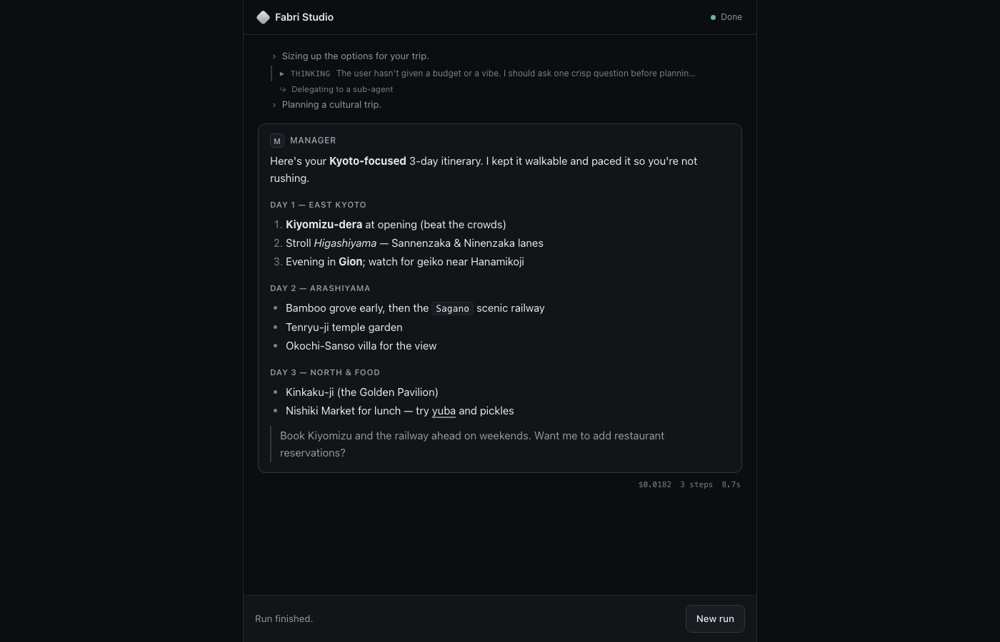

# Fabri Studio

A **conversational + observability front-end you can drop onto any fabri
agency**. Submit a task, watch the run's plan, tool calls, and cost stream in,
answer the manager's questions mid-run, follow up in the same thread, browse past
runs, and — for fan-out agencies — roll up a whole **fleet** of pipelines with
their summed COGS. It's an example/template you copy and adapt: a React app +
fabri's built-in `fabri serve`, no backend of its own.



## What it shows

Studio maps fabri's typed run events onto distinct message classes so a run
reads like a conversation, not a log:

| fabri event | Studio renders it as |
| --- | --- |
| the root agent's `final` | **the manager's message** — the primary, load-bearing bubble |
| `narration` | a light "what's happening now" line (the narrator) |
| `thought` | a collapsible reasoning card |
| `plan_started` / `plan_item_*` / `plan_finished` | a live **step timeline** ("step 2 of 5") |
| `tool_started` + `tool_call` | a **tool-call card** — name, status, duration, expandable args/result |
| `parallel_group_started` / `spawn_subagent` | a parallel group header / nested sub-agent card |
| `ask_user` | an **interactive question card** — the manager pauses and asks you |
| `usage` | a **COGS panel** — total, per-model breakdown, tokens, steps, sub-agent split |
| `cost_unaccounted` / `discrepancy` | a **warning** — under-reported spend or a claimed-but-unverified write |
| `structured_output` (invalid) | a quiet schema-retry note |
| `failed` / `incomplete` / `error` | a terminal status |

The `ask_user` round-trip is the interesting part: the manager blocks mid-run,
its question streams to the browser over SSE, and your answer flows back to
unblock it — see [How it works](#how-it-works).

## Four surfaces

- **Conversation** — a live thread. Submit a task, watch it stream, then send a
  follow-up: turns share a `thread_id` and a memory collection, and a transcript
  preamble carries continuity. Stop a run mid-flight; start a new thread anytime.
- **Company** — a second skin over the live trace: a playful Office view shows
  agent avatars, handoffs, and payroll, while Org chart makes the same agency
  structure and task memos precise and inspectable.
- **Fleet** — Studio as a whole-agency UI. Paste one item per line to fan a batch
  out to N pipelines (`POST /fleets`); the roll-up shows done/running/blocked
  counts and the **summed fleet COGS** (+ per-model), with drill-down into any
  item's run. This is the front-end a fan-out agency (à la Microsite Factory)
  ships with instead of a bespoke dashboard.
- **History** — every past run, rebuilt from a persisted index that survives a
  `fabri serve` restart. Open any run read-only to replay its timeline and cost.

## Quickstart

You need Python ≥3.11 (with fabri installed) and Node ≥18.

```bash
# 1. Install fabri with the sqlite memory backend (no Qdrant/Docker needed).
pip install -e ".[sqlite]"          # from the repo root

# 2. Start the backend: fabri's built-in HTTP/SSE service, pointed at an agency.
export ANTHROPIC_API_KEY=...        # or edit demo/agent.yaml for another provider
fabri serve --config examples/studio/demo/agent.yaml
#   → fabri serve listening on http://127.0.0.1:8080

# 3. In another terminal, start Studio.
cd examples/studio
npm install
npm run dev
#   → http://localhost:5173
```

Open <http://localhost:5173>, type something like *"plan a weekend trip"*, and
hit **Run**. The demo agency is configured to ask you a clarifying question
before it answers — you'll see the question card appear mid-run.

Pointing at a different `fabri serve` host/port? Set `FABRI_SERVE_URL`:

```bash
FABRI_SERVE_URL=http://127.0.0.1:9000 npm run dev
```

## Drop it onto your own agency

Studio is agency-agnostic — it only speaks the `fabri serve` HTTP API. To use
your own config, just point `fabri serve` at it:

```bash
fabri serve --config path/to/your/agent.yaml
```

To get the most out of the UI, your config should:

- **configure a `llm.narrator`** — the cheap-model progress stream (see
  [`demo/agent.yaml`](./demo/agent.yaml)); without it, the light narration lines
  simply don't appear.
- **enable the `ask_user` tool** if you want the mid-run question card.

## How it works

```
 browser (Vite :5173)                    fabri serve (:8080)
 ────────────────────                    ──────────────────────
 POST /runs ─────────────────────────▶   launches `fabri run` subprocess
 EventSource /runs/<id>/events ◀──────    tails the run's trace JSONL (SSE)
   … start, plan_*, thought,              each trace event → one SSE frame
     tool_started, ask_user, usage …
 POST /runs/<id>/answer ─────────────▶    delivers the answer to the run's
                                          ask_user Unix socket, unblocking it
 POST /runs/<id>/cancel ─────────────▶    terminates a still-running agent
 GET  /runs ─────────────────────────▶    persisted run history (survives restart)
 POST /fleets ───────────────────────▶    fans a batch out to N runs (one fleet_id)
 GET  /fleets, /fleets/<id> ─────────▶    fleet roll-ups: statuses + summed COGS
```

- **Transport** is fabri's existing `fabri serve` — Studio adds no backend of
  its own. Runs, history, cancel, and fleets are all thin seams over the same
  per-run subprocess + trace model (a fleet is just N tagged runs; history is a
  small on-disk index). The Vite dev server proxies `/runs`, `/fleets`, and
  `/health` so the browser stays same-origin (`fabri serve` sets no CORS headers).
- **Human-in-the-loop**: `fabri serve` runs a per-run listener on a Unix socket
  and points the agent's `ask_user` tool at it. When the agent asks a question,
  the listener writes an `ask_user` event into the run's trace (so it reaches the
  browser over the *same* SSE stream, carrying its `question_id`) and holds the
  socket open until `POST /runs/<id>/answer` supplies the answer.
- **Authentication is optional for conversation.** With auth enabled, guests can
  browse the roster and run a live thread immediately. Signing in attaches new
  runs to an account so they appear in the persistent Conversations sidebar;
  account dashboards and saved replay remain private to that user.

## Layout

```
examples/studio/
  demo/agent.yaml        a self-demonstrating sqlite-backed agency
  src/
    lib/events.ts        the fabri event → message-class mapping (the core contract)
    lib/timeline.ts      builds the timeline: dedupe, tool pairing, plan aggregation
    lib/api.ts           the fabri serve HTTP client (runs, cancel, history, fleets)
    hooks/useRunEvents.ts a thread of runs, each streamed over one EventSource
    components/
      Message, PlanTimeline, ToolCall, CostSummary   the conversation
      AskUserCard, Composer                          input + human-in-the-loop
      HistoryList, RunReplay                         conversation sidebar + read-only replay
      FleetView, AccountTile                         fleet roll-up + drill-down
    App.tsx              the four-surface shell (Conversation / Company / Fleet / History)
  vite.config.ts         dev proxy → fabri serve
```

## Scope

Studio is a copy-and-adapt template, not a hosted product. It does multi-turn
threads, run history, cancel/retry, live COGS, fleet roll-ups, and optional
email/password isolation. The active guest thread lives in browser memory (a
hard reload drops it); signed-in runs are recoverable from the Conversations
sidebar and remain scoped to their owner.
